Title: Streaming App (Magic the Gathering Themed)  
Author: Brooke Taylor  
Date: 03/28/2024  
Description: This project was taken from the book, Designing and Prototyping Interfaces with Figma by Fabio Staiano. I enjoyed reading through this book and learning Figma. Having a background using Adobe's Photoshop and Illustrator some of Figma came naturally but my experience alone didn't give me a solid understanding. Going through this book and designing this prototype was a fun and rewarding experience. 

# Streaming App

**Mobile View Breakpoint (375px)**

[Mobile Prototype](https://www.figma.com/proto/VzwMM2EeoLnRnAGtwtax8p/Streaming-App?type=design&node-id=1-2&t=V0nj1cDlaSwQ7ZJ1-0&scaling=scale-down&page-id=0%3A1&starting-point-node-id=1%3A2)

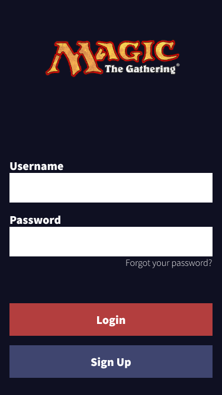 &ensp; 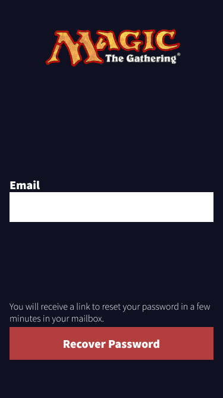 &ensp; 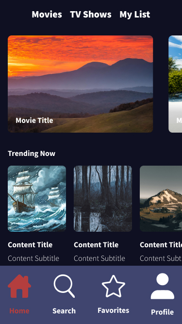 &ensp; 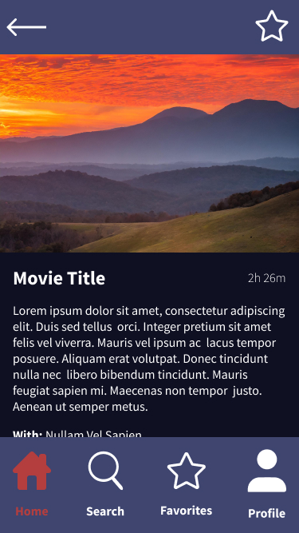 &ensp; 

---

**Tablet View Breakpoint (744px)**

[Tablet Prototype](https://www.figma.com/proto/VzwMM2EeoLnRnAGtwtax8p/Streaming-App?type=design&node-id=126-2995&t=67arp7laVEc08Mk7-0&scaling=scale-down&page-id=126%3A2994&starting-point-node-id=126%3A2995)

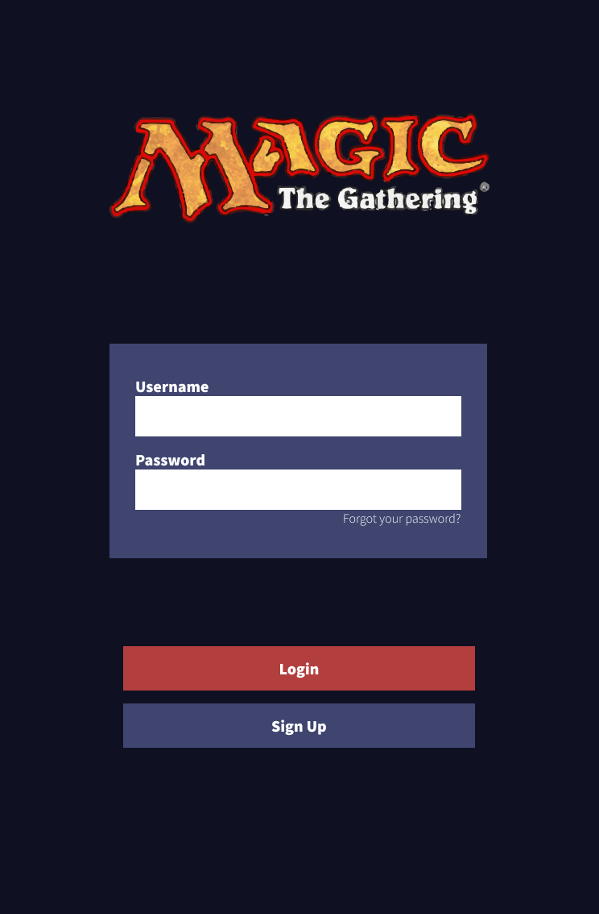 &ensp; 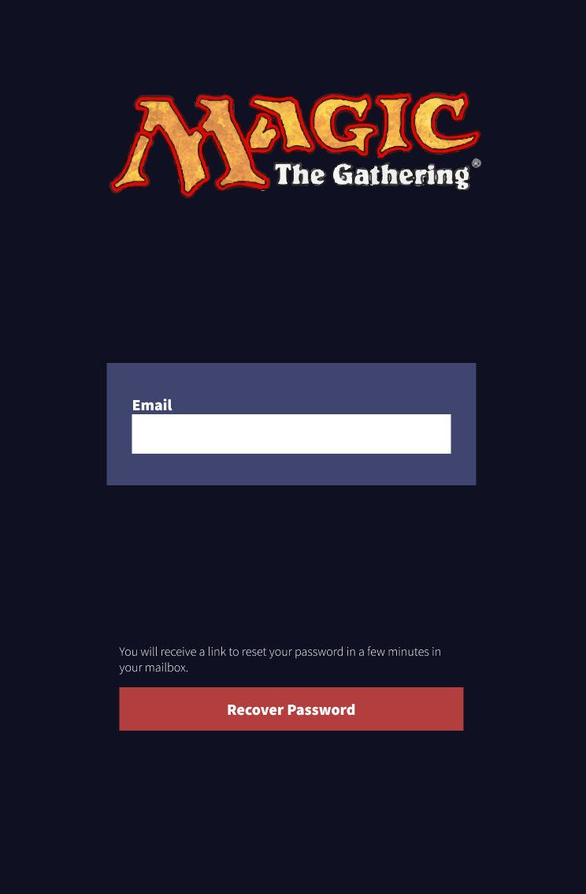 &ensp; 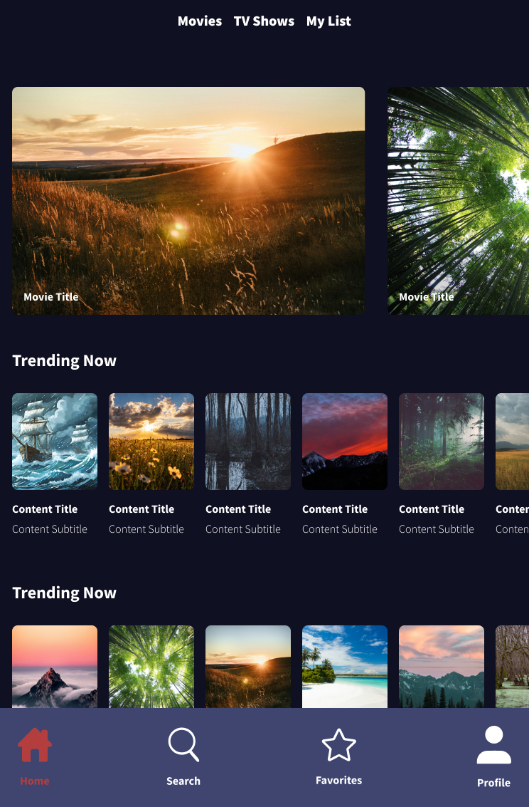 &ensp; 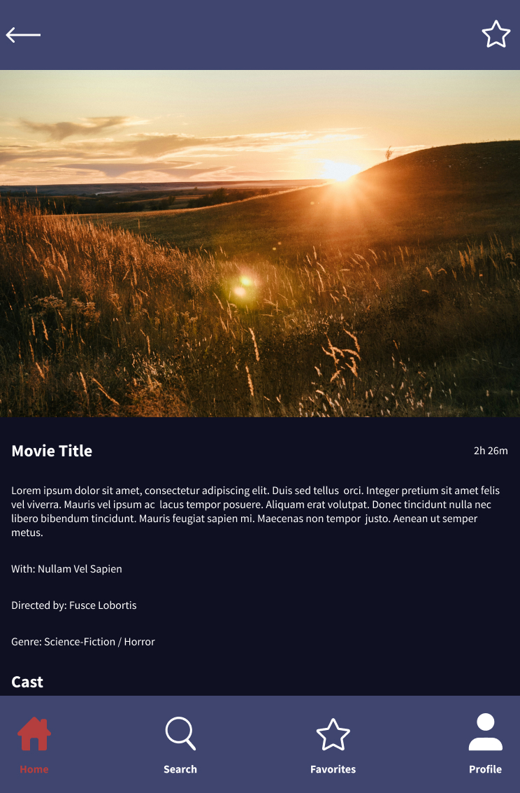 &ensp; 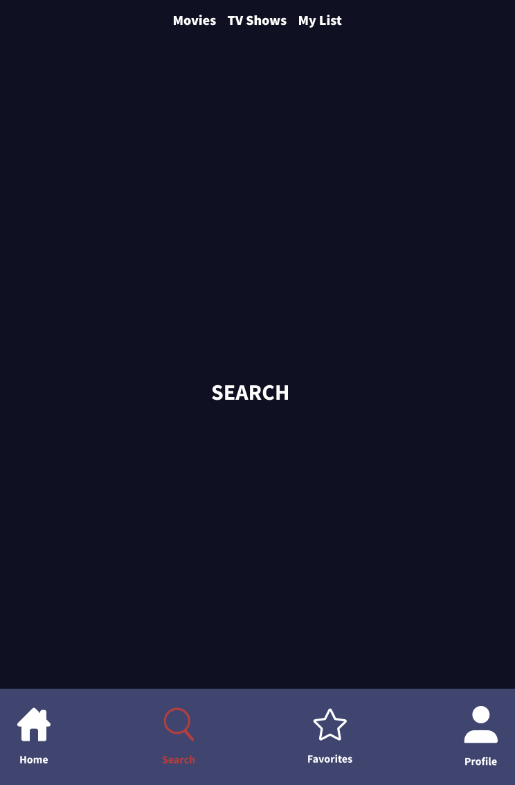

---

**Desktop View Breakpoint (1440px)**

[Desktop Prototype](https://www.figma.com/proto/VzwMM2EeoLnRnAGtwtax8p/Streaming-App?type=design&node-id=191-3126&t=67arp7laVEc08Mk7-0&scaling=min-zoom&page-id=191%3A3125&starting-point-node-id=191%3A3126)

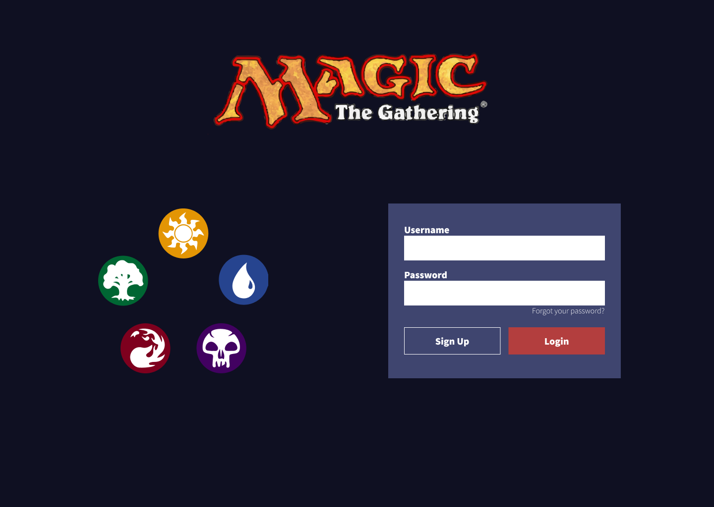 &ensp; 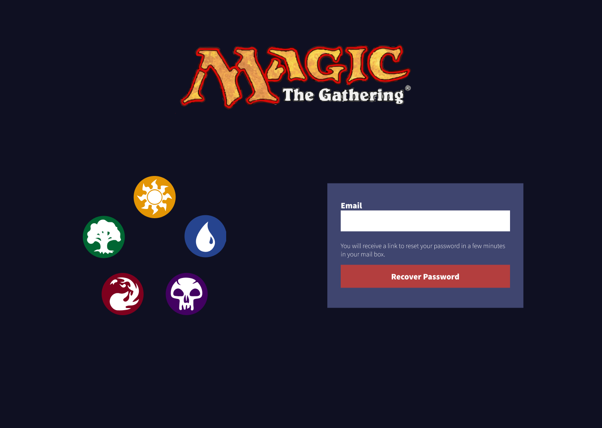 &ensp; 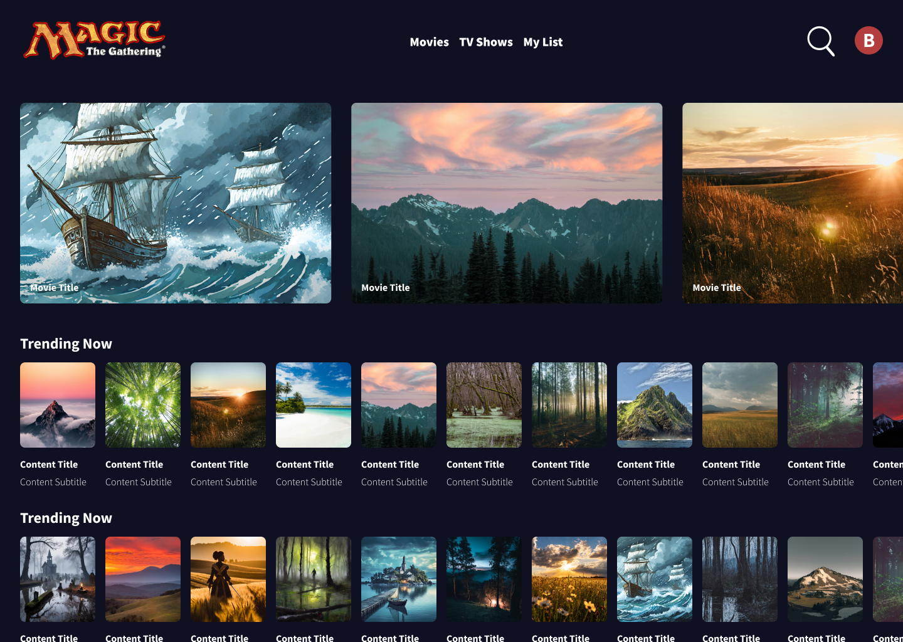 &ensp; 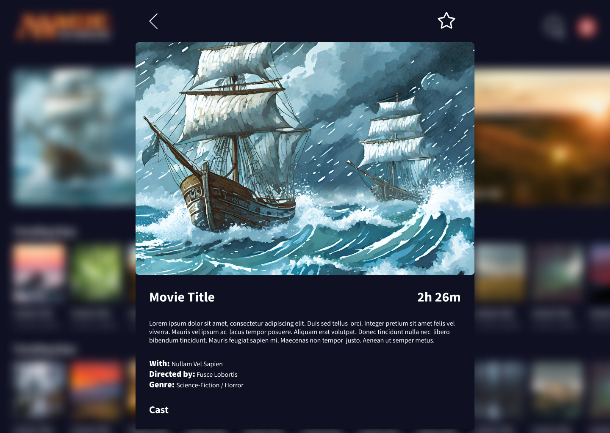 &ensp; 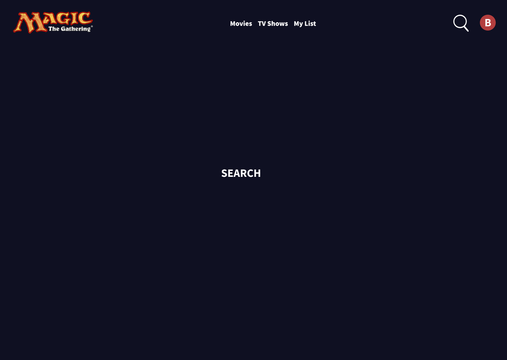

